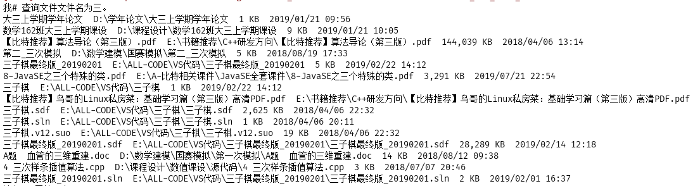
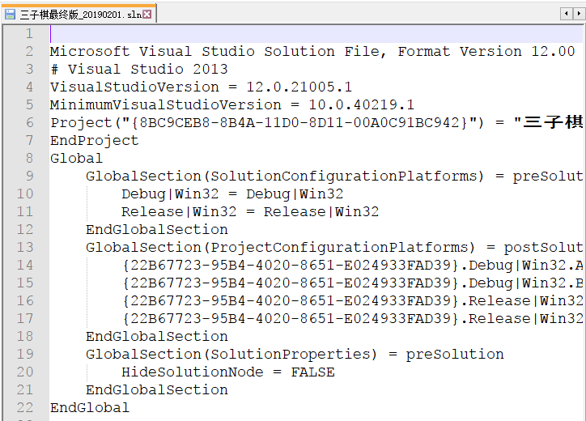
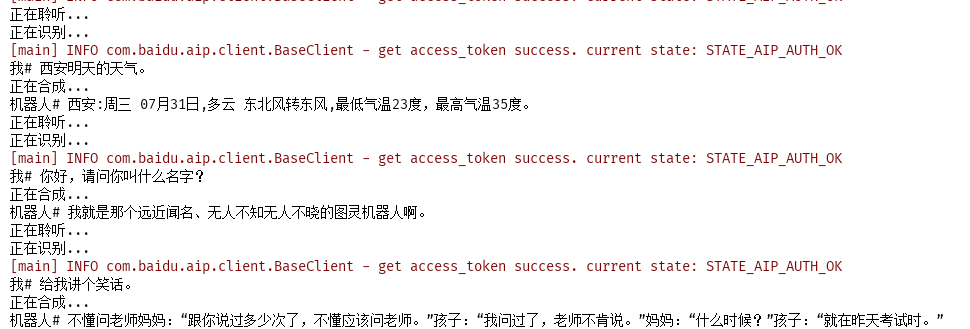
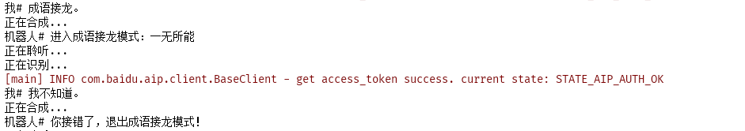

## 项目名称
my sweety
## 项目描述
这是一个既可以陪你聊天，又可以帮你打开应用软件和文件的贴心小能手
## 项目功能
+ 支持文件，目录的搜索和打开
+ 支持打开应用软件，如打开微信，打开浏览器等
+ 支持聊天对话，图片搜索，天气查询，成语接龙等功能
## 使用技术
+ 多线程
+ Json-lib序列化工具
+ 图灵机器人接口
+ 百度语音识别和语音合成
+ JLayer音频播放工具
## 效果展示
+ 文件或目录的搜索和打开
  + 文件搜索

  + 文件选择和打开

+ 打开应用软件，如微信
  + 打开微信

+ 天气查询、聊天对话、成语接龙
  + 天气查询、聊天对话

  + 成语接龙

+ 图片搜索
  + 图片名称及搜索结果

